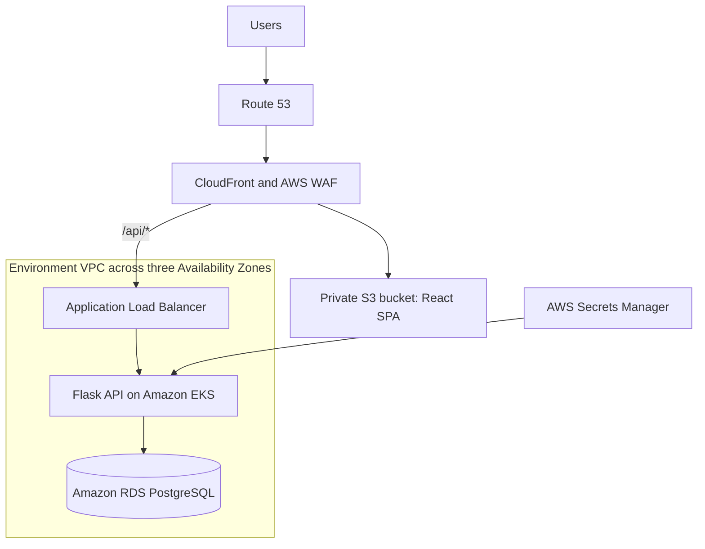

# Innovate Inc. AWS Architecture

AWS is selected for this design, using Amazon EKS for Kubernetes and Amazon RDS for PostgreSQL. The platform starts small but can scale as traffic grows.

## 1. Cloud Environment Structure

### AWS accounts and justification

Use AWS Organizations with five accounts:

| Account | Purpose |
|---|---|
| Management | AWS Organizations, consolidated billing, and account administration only. |
| Shared | Account for shared services used by the other environments. |
| Development | Development workloads and developer access. |
| Staging | Production-like testing with smaller resources. |
| Production | Customer workloads and sensitive production data. |

Separate environment accounts isolate production from development mistakes and compromised credentials. AWS Organizations provides consolidated billing with costs visible per account. IAM Identity Center centralizes access, and Service Control Policies apply basic organization-wide restrictions.

## 2. Network Design

### VPC architecture

Each environment account has a separate VPC with a non-overlapping CIDR. Production and staging use three Availability Zones. Each AZ has:

- A public subnet for an internet-facing Application Load Balancer and NAT Gateway.
- A private application subnet for EKS nodes and pods.
- A private database subnet for RDS PostgreSQL.

The Internet Gateway is attached to the VPC. EKS nodes and RDS have no public IP addresses. Production uses one NAT Gateway per AZ. Staging uses the same layout with smaller resources, while development can use one NAT Gateway to reduce cost. A free S3 gateway endpoint keeps S3 and ECR image-layer traffic away from the NAT Gateway.

### Network security

- CloudFront and AWS WAF protect the public entry point, and ACM provides TLS certificates.
- The ALB accepts HTTPS traffic; the API accepts traffic only from the ALB.
- RDS accepts port 5432 only from the application security group and is not publicly accessible.
- Secrets are stored in Secrets Manager and provided to EKS through External Secrets Operator and EKS Pod Identity.
- Kubernetes NetworkPolicies and VPC Flow Logs can be added when stronger workload isolation or auditing is required.

## 3. Compute Platform

### Kubernetes deployment and management

Use one EKS cluster in each environment account. The Flask API runs as a Kubernetes Deployment installed with Helm and managed by Argo CD. React is preferably hosted as static files in S3 behind CloudFront, but it can also run in an EKS pod when server-side behavior or a single Kubernetes deployment model is required.

The API runs with at least two replicas, health probes, rolling updates, a PodDisruptionBudget, and pod anti-affinity. External Secrets Operator provides application secrets, and Metrics Server supplies CPU and memory metrics to the Horizontal Pod Autoscaler.

### Node groups, scaling, and resource allocation

Use a small On-Demand EKS Managed Node Group for Karpenter and critical cluster components. Karpenter creates and removes application nodes according to pending pod demand:

- Development and staging can use a mix of On-Demand and Spot application nodes to balance reliability and cost.
- Production uses On-Demand application nodes for predictable availability.
- Horizontal Pod Autoscaler scales API replicas.
- CPU and memory requests and limits guide scheduling and prevent one workload from consuming all cluster resources.

### Containerization, registry, and deployment

The Flask backend and React frontend use separate repositories and GitHub Actions pipelines to test and build their application artifacts. Backend images are stored in shared ECR and deployed to EKS with Helm and Argo CD. Frontend files are deployed to S3 and served through CloudFront. Development and staging deploy automatically, while production requires approval.

## 4. Database

### PostgreSQL service and justification

Amazon RDS for PostgreSQL is a good option for a small company because it reduces operational work, supports future scaling, and provides managed backups, patching, monitoring, and failover.

Development uses a small Single-AZ instance. Staging uses the same Multi-AZ design as production with smaller resources. Production uses Multi-AZ with encrypted storage. RDS can scale by increasing the instance size and storage as the application grows.

### Backups, high availability, and disaster recovery

- Staging and production use Multi-AZ for automatic failover if an Availability Zone fails.
- RDS automated backups provide point-in-time recovery for recent data.
- AWS Backup can retain production snapshots according to the company's retention requirements and copy them to a second Region for regional recovery.
- Restore tests verify that the backups are usable.

For a regional failure, restore the latest cross-region snapshot and recreate the infrastructure from code.
